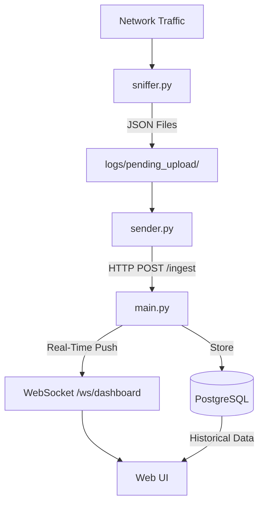

# Documentation Index

Welcome to the Network Traffic Analyzer documentation! This index will guide you to the right documentation for each component.

---

## 📚 Documentation Files

### **Client-Side Components**

1. **[sniffer_explained.md](sniffer_explained.md)** - Packet Capture Module
   - **What it does:** Captures network packets and saves to JSON files
   - **Read this if you want to:**
     - Understand how packet capture works
     - Change capture intervals or filters
     - Troubleshoot packet capture issues
     - Optimize memory usage

2. **[sender_explained.md](sender_explained.md)** - File Upload Manager
   - **What it does:** Monitors JSON files and uploads to server
   - **Read this if you want to:**
     - Understand the file monitoring system
     - Configure upload retry logic
     - Troubleshoot upload failures
     - Manage processed/failed files

---

### **Server-Side Components**

3. **[main_explained.md](main_explained.md)** - FastAPI Server
   - **What it does:** Receives data and provides web dashboards
   - **Read this if you want to:**
     - Understand the API endpoints
     - Configure database connections
     - Set up web dashboards
     - Add new API endpoints


---

## 🗺️ Quick Navigation

### By Task

| I want to... | Read this file |
|--------------|----------------|
| Set up packet capture | [sniffer_explained.md](sniffer_explained.md) |
| Configure file uploads | [sender_explained.md](sender_explained.md) |
| Set up the server | [main_explained.md](main_explained.md) |
| Deploy the entire system | [../DEPLOYMENT.md](../DEPLOYMENT.md) |
| Understand database schema | [DATABASE_SCHEMA.md](DATABASE_SCHEMA.md) |

---

### By Component

```
┌─────────────────────────────────────────────────────┐
│                 CLIENT SIDE                         │
│─────────────────────────────────────────────────────│
│                                                     │
│  sniffer.py          →    sender.py                │
│  [sniffer_explained]      [sender_explained]       │
│                                                     │
│  Captures packets         Uploads to server        │
│                                                     │
└─────────────────────────────────────────────────────┘
                         ↓
                    (HTTP POST)
                         ↓
┌─────────────────────────────────────────────────────┐
│                 SERVER SIDE                         │
│─────────────────────────────────────────────────────│
│                                                     │
│  main.py (integrated aggregation + ML)              │
│  [main_explained]                                   │
│                                                     │
│  Receives data, aggregates, predicts                │
│                                                     │
└─────────────────────────────────────────────────────┘
```

---

## 📖 Reading Order

### For New Users
1. Start with [../README.md](../README.md) - Project overview
2. Read [sniffer_explained.md](sniffer_explained.md) - Understand capture
3. Read [sender_explained.md](sender_explained.md) - Understand uploads
4. Read [main_explained.md](main_explained.md) - Understand server + ML
5. Follow [../DEPLOYMENT.md](../DEPLOYMENT.md) - Deploy system

### For Developers
1. [sniffer_explained.md](sniffer_explained.md) - Client capture logic
2. [sender_explained.md](sender_explained.md) - Client upload logic
3. [main_explained.md](main_explained.md) - Server API + ML pipeline
4. [aggregation_strategy.md](aggregation_strategy.md) - Aggregation approach

### For System Administrators
1. [../DEPLOYMENT.md](../DEPLOYMENT.md) - Deployment guide
2. [main_explained.md](main_explained.md) - Server configuration
3. [DATABASE_SCHEMA.md](DATABASE_SCHEMA.md) - Database structure

---

## 🔧 Component Details

### **sniffer.py** (Lines: ~630)
- **Language:** Python
- **Dependencies:** Scapy, threading, argparse
- **Requires:** Admin/root privileges
- **Output:** JSON files in `logs/pending_upload/`
- **Key Features:**
  - CLI interface (`-i`, `--list`, `--send`)
  - Multi-interface capture
  - 30+ packet features
  - Atomic file writes
  - 5s save interval

### **sender.py** (Lines: ~250)
- **Language:** Python
- **Dependencies:** requests
- **Requires:** Network access to server
- **Input:** JSON files from `logs/pending_upload/`
- **Key Features:**
  - Continuous file monitoring (1s poll)
  - HTTP uploads with retry
  - Connection pooling
  - Failed upload queue

### **main.py** (Lines: ~1400)
- **Language:** Python (FastAPI)
- **Dependencies:** FastAPI, SQLAlchemy, PostgreSQL, XGBoost
- **Port:** 8000 (default)
- **Key Features:**
  - `/ingest` endpoint for packet ingestion
  - Integrated MultiWindowAggregator (5s/30s/180s)
  - Real-time dashboard with charts
  - JSON APIs for alerts and features

### Issue: Flows not being created
→ Read: [aggregation_strategy.md](aggregation_strategy.md)

---

## 🎯 Quick Reference

### Configuration Files

| Setting | File | Location | Default |
|---------|------|----------|---------|
| Database URL | .env | `DATABASE_URL` | `postgresql://...` |
| Server URL | .env | `SERVER_URL` | `http://localhost:8000/ingest` |
| ML Model Path | .env | `ML_MODEL_PATH` | `server/models/xgboost_model.json` |
| Save interval | sniffer.py | CLI `-s` | 5s |

### Important Directories

| Directory | Purpose | Created by | Used by |
|-----------|---------|------------|---------|
| `logs/pending_upload/` | JSON files waiting upload | sniffer.py | sender.py |
| `logs/processed/` | Successfully uploaded | sender.py | - |
| `logs/failed_uploads/` | Failed uploads | sender.py | sender.py (retry) |

### Database Tables

| Table | Purpose | Written by | Read by |
|-------|---------|------------|---------|
| `raw_packets` | Complete packet logs | main.py | main.py (aggregator) |
| `aggregated_features` | Multi-window ML features | main.py | main.py (dashboard) |
| `detected_alerts` | Security alerts | main.py | main.py (dashboard) |

---

## 📞 Getting Help

1. **Check the relevant component documentation** (see navigation above)
2. **Review troubleshooting sections** in each file
3. **Check logs** for error messages
4. **Review [DEPLOYMENT.md](../DEPLOYMENT.md)** for setup issues

---

## 🔄 Data Flow Summary



---

## 📝 Document Metadata

- **Created:** 2025-11-29
- **Last Updated:** 2026-01-18
- **Total Documentation Files:** 12+

For the complete project overview, see [README.md](../README.md)  
For deployment instructions, see [DEPLOYMENT.md](../DEPLOYMENT.md)
