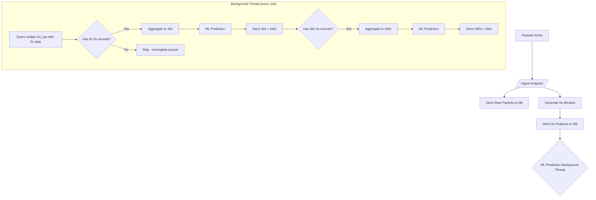

# Cascading Multi-Window Aggregation Strategy

## 🏗️ Architecture Overview

The system uses a **Cascading Aggregation** approach where:
1. **5s windows** are generated synchronously during ingestion.
2. **30s and 180s windows** are built asynchronously from database-stored 5s records by a background thread.

This ensures that larger time windows contain the **correct amount of historical data** (e.g., a 30s window aggregates 6 complete 5s records from the same `src_ip`).

---

## 🔄 The Process Flow



---

## 📊 Key Behaviors

| Feature | Description |
|---------|-------------|
| **Count-Based Triggering** | 30s window requires ≥6 5s records; 180s requires ≥36 5s records. |
| **Per-IP Grouping** | Aggregation is done per `src_ip` to maintain traffic source granularity. |
| **Parallelized Processing** | Uses `ThreadPoolExecutor` (4 workers) to process multiple IPs concurrently. |
| **Inline ML Prediction** | `predict_and_alert()` is called immediately after each 30s/180s record is created. |
| **Duplicate Prevention** | Checks for existing records before inserting to avoid duplicates. |

---

## 🔢 Window Sizes & Usage

| Window Size | Source | Purpose |
|-------------|--------|---------|
| **5 Seconds** | Raw packets (sync) | Real-time attack detection, immediate dashboard spikes. |
| **30 Seconds** | 6× 5s records (async) | Standard ML model input, stable traffic profiling. |
| **180 Seconds** | 36× 5s records (async) | Slow-rate attack detection, persistent threats, capacity planning. |

---

## ⚡ Performance Optimizations

1. **Composite Database Index**: `idx_agg_window_src_start` on `(window_size, src_ip, window_start)` for fast lookups.
2. **Thread-Safe Sessions**: Each parallel worker uses its own SQLAlchemy session.
3. **Incremental Processing**: Only processes buckets that don't already exist in the database.

---

## 💡 Implementation Details

### Ingestion (5s only)
```python
# In _process_packets()
agg_df = aggregator.process_file(tmp_path, window_sizes=[5])
```

### Cascading Aggregation (Background)
```python
# In run_cascading_aggregation() - runs every 10 seconds
with ThreadPoolExecutor(max_workers=4) as executor:
    for src_ip in pending_ips:
        executor.submit(aggregate_for_ip, src_ip)

def aggregate_for_ip(src_ip):
    aggregate_windows_for_ip(db, src_ip, 5, 30)   # 5s -> 30s
    aggregate_windows_for_ip(db, src_ip, 5, 180)  # 5s -> 180s
```

### Inline ML Prediction
```python
# After creating each 30s/180s record
predict_and_alert(db_session, agg_rec)
```
